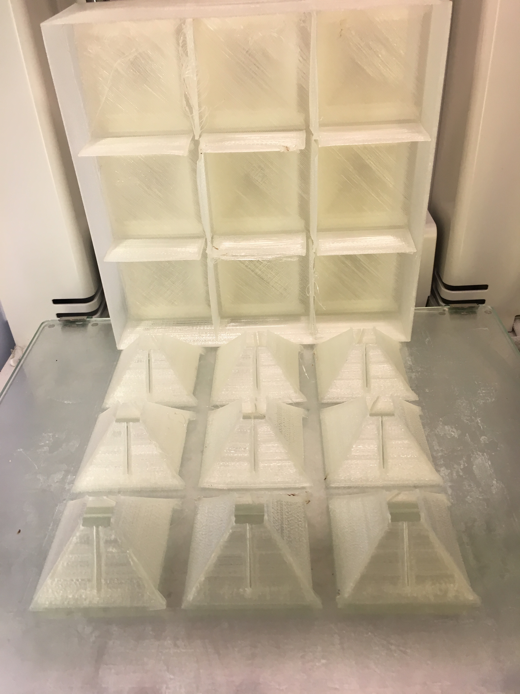
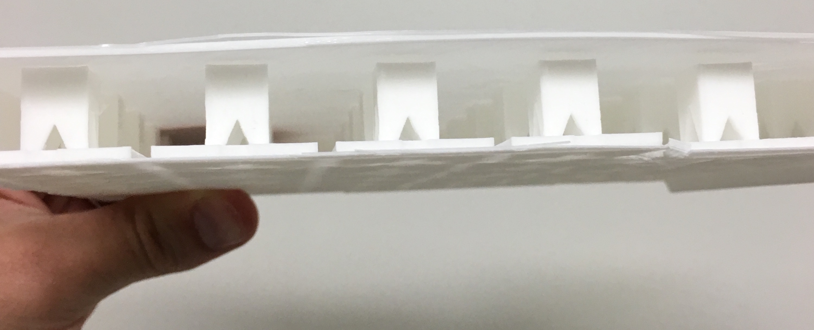
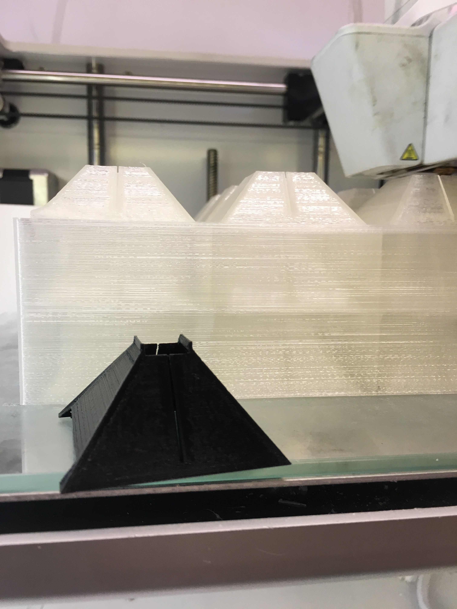
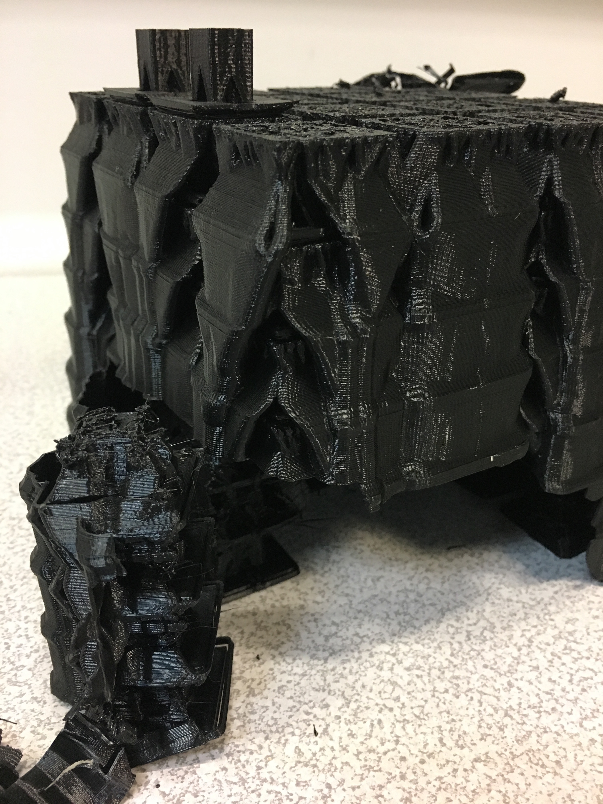
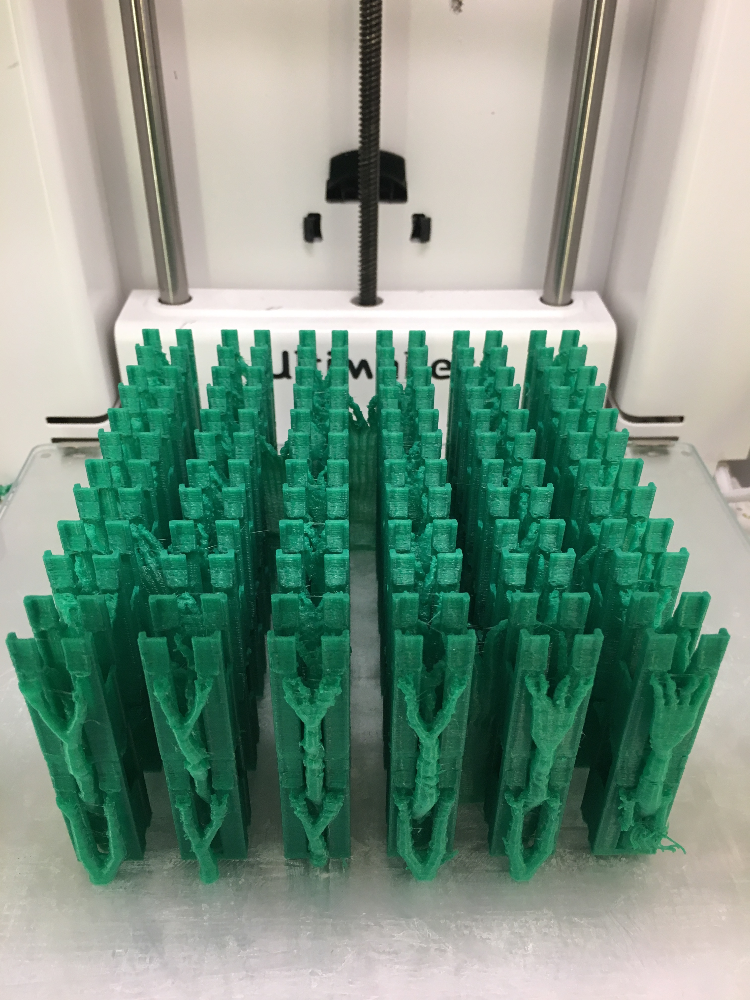

# RaftStacking
A SCAD script to stack a given 3D file vertically quickly, and optionally provide rafts at each vertical layer to help support printing files that are not top-bottom flat and symmetrical. This was created to print many more items per printing session, so that multi-day prints of many items can be made without constanly resetting the printer. I've used this script to make many 3D printed STEM kits that go to over 11 elementary school science classrooms for [TITIL](http://titil.tamu.edu) and the [Making the Maker project](http://thestorylab.arch.tamu.edu/research/making%20the%20maker/) at Texas A&M University

Given any 3D file, you need to record it's X,Y,Z dimensions in CAD or a slicer and find its offset from the origin. From there, this script can generate a full buildplate based on your printer volume (MANUAL_GRID = true;), or a specified number of copies in a x,y,z grid. There are effectively 3 methods of printing I have explored with this script:

(1)  Printing with Layer-Rafts: the script can generate one huge STL file that has both the stacks and a supporting raft, held up by a grid of optional walls surrounding each print. You will need to save supports to your design ahead of time if they are needed. dupontFemaleWireHolders4LEDs_Manufacture_5Layers.stl is an example file of this setting, where each item is a small holder for two female dupont jumper wires to fit snugly on the inside to host an LED on top, with wires outside and back in to keep everything robust and in-place.
(SEPARATE_FILES = false;)

(2) Printing by stacking or using slicer-supports: the script can generate the STL file without any rafts, letting the slicer build support. I've found Cura's tree support breaks apart fairly easily. In this mode you will not need to pre-save supports 
(SEPARATE_FILES = true; EXPORT_SUPPORT = false;)

(3) Printing with multi-materials: this is the most difficult option to print, but if tuned, may speed up actual production considerably. The script can export two seperate STL files for the copied design and the raft-supports. You may do multi-material prints, printing the support in a soluable material (e.g. PVA, HIPS) or a FDM support-specific material (e.g breakaway material). The design material will not adhese well to rafts unless printing temperatures are similar between the materials and unless the build area is enclosed. Once printed, the supports can be removed more easily with this method, requiring less human hours to seperate these prints
